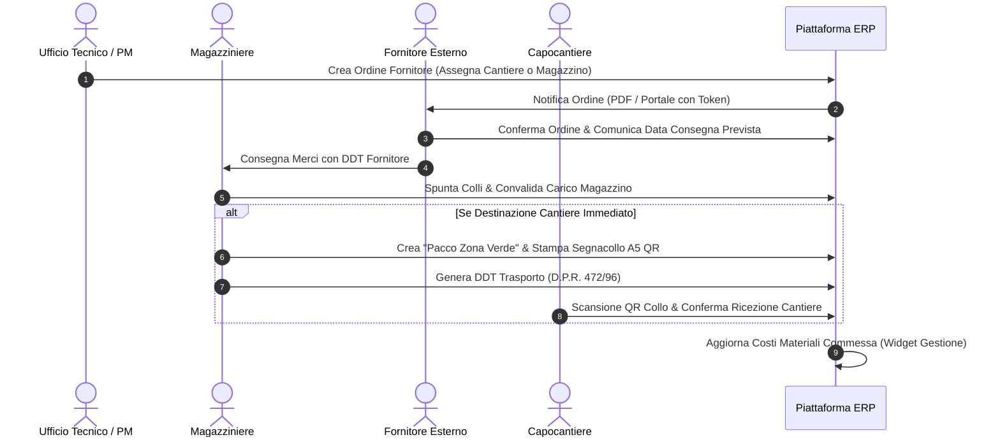
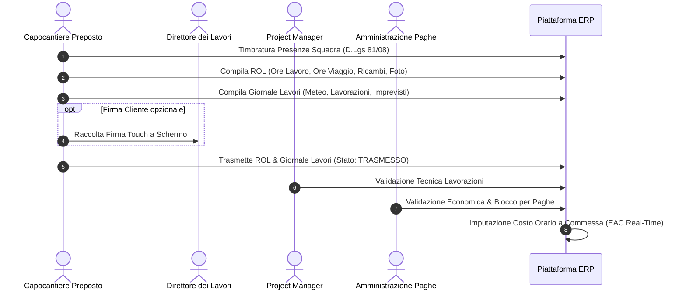
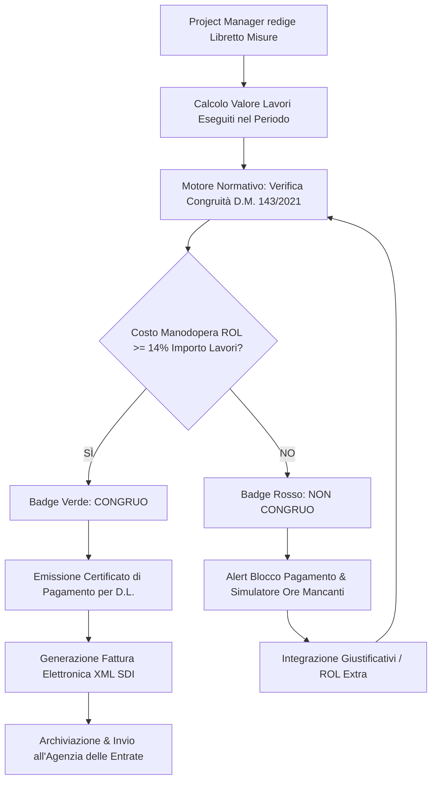
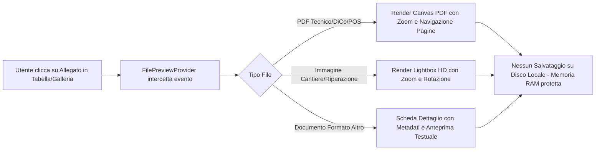

# SCHEMI A BLOCCHI DEI RUOLI, MODULI & WORKFLOW OPERATIVI
**Piattaforma Gestionale Integrata Cantieri, Logistica, Impianti & Sicurezza**  
*Documento Tecnico Ufficiale di Architettura e Processi Aziendali*  
**Versione:** 4.0 (Full Cloud Firestore + PWA Offline + Moduli Cantiere 2026)  
**Riferimenti Normativi:** D.Lgs. 81/2008 · D.M. 143/2021 (Congruità CNCE) · D.P.R. 472/1996 (DDT) · D.M. 37/2008 (DiCo) · Norme CEI 64-8 e CEI 11-27 (PES/PAV/PEI)

---

## 1. MAPPA DEI BLOCCHI FUNZIONALI

La piattaforma è articolata in moduli operativi interconnessi tramite un layer di persistenza in tempo reale (Firebase Firestore) con supporto per la cache offline in locale (IndexedDB / PWA).

```
┌──────────────────────────────────────────────────────────────────────────────────┐
│                            ARCHITETTURA MODULARE ERP                             │
├─────────────────────┬──────────────────────┬─────────────────────────────────────┤
│ 1. CANTIERE & CAMPO │ 2. LOGISTICA & ASSET │ 3. CONTABILITÀ & SAL │ 4. SICUREZZA │
│ Dashboard Cantiere  │ Magazzino & Pacchi   │ SAL & Libretto Misure│ Cruscotto 81 │
│ ROL & Ore Lavoro    │ Segnacolli A5 QR     │ Congruità D.M. 143   │ Scadenze DVR │
│ Giornale dei Lavori │ DDT Trasporto        │ Controllo di Gestione│ Idoneità Med.│
│ Gantt Squadre       │ Ordini Fornitori     │ Fatturazione SDI XML │ Patentini    │
│ Presenze D.Lgs 81   │ Ordini Clienti       │ Preventivi & Computi │ Deleghe Resp.│
└─────────────────────┴──────────────────────┴──────────────────────┴──────────────┘
```

### 1.1 Schede dei Singoli Blocchi Funzionali

#### BLOCCO 1: Dashboard Riepilogativa di Cantiere
- **Descrizione:** Vista consolidata a 360° della singola commessa con aggregazione in tempo reale di materiali, mezzi assegnati, avanzamento SAL, galleria fotografica e documenti tecnici.
- **Funzioni Principali:**
  - KPI economici (Budget contrattuale, Avanzamento %, Costo Manodopera consuntivo, Costo Materiali).
  - Sezione Materiali dedicati con stato consegna e giacenza.
  - Sezione Attrezzature e Veicoli impegnati sul cantiere.
  - Galleria fotografica As-Built con anteprima full-screen senza download.
  - Tabella documenti con badge di stato e conformità.
- **Dipendenze:** ROL, DDT, SAL, Attrezzature, Documenti.
- **Stato:** ✅ Completato e Funzionante.

#### BLOCCO 2: Portale Logistica & Gestione Mezzi e Attrezzatura
- **Descrizione:** Sistema per il controllo operativo della flotta aziendale (furgoni allestiti, camion gru) e delle attrezzature di lavoro (piattaforme aeree, strumenti di misura CEI 64-8, demolitori).
- **Funzioni Principali:**
  - Anagrafica asset con matricola, targa, costruttore e stato disponibilità.
  - Scadenzario revisioni, tagliandi, assicurazioni e verifiche periodiche INAIL (All. VII D.Lgs. 81/08).
  - Tracciamento tarature strumenti di misura (certificati LAT per strumenti di collaudo).
  - Assegnazione automezzi a squadre e cantieri con tracciamento chilometrico.
  - Visualizzazione mappa geografica asset sul territorio.
- **Dipendenze:** Cantiere, Dipendenti, Manutenzioni.
- **Stato:** ✅ Completato e Funzionante.

#### BLOCCO 3: Ordini Fornitori (Sezione Acquisti)
- **Descrizione:** Gestione del ciclo di approvvigionamento materiali dai fornitori elettrici/edili (es. Sacchi, Comoli Ferrari, Sonepar, grossisti locali).
- **Funzioni Principali:**
  - Emissione ordine con indicazione cantiere destinatario o reintegro magazzino centrale.
  - Tracciamento stato ordine: *Bozza -> Inviato -> Parzialmente Evaso -> Consegnato*.
  - Indicazione data arrivo prevista e vettore.
  - Collegamento diretto al DDT fornitore in ingresso con spunta colli.
- **Dipendenze:** Magazzino, Cantieri, Fornitori.
- **Stato:** ✅ Completato e Funzionante.

#### BLOCCO 4: Ordini Clienti & Ordini Interni
- **Descrizione:** Gestione delle richieste d'ordine originate da committenti o internamente da capicantiere per lavorazioni extra-contratto o varianti.
- **Funzioni Principali:**
  - Registrazione commessa di destinazione, cliente ordinante e listino applicato.
  - Approvazione interna Ufficio Tecnico / Project Manager prima dell'acquisto.
  - Workflow di evasione con assegnazione al lotto di montaggio.
- **Dipendenze:** Cantieri, Preventivi, Magazzino.
- **Stato:** ✅ Completato e Funzionante.

#### BLOCCO 5: Viewer Universale File & Anteprima Senza Download
- **Descrizione:** Componente trasversale per ispezionare istantaneamente PDF (schemi unifilari, contratti, DiCo), immagini (foto di cantiere, rilievi termografici) e documenti tecnici senza costringere l'utente a scaricare file su smartphone o desktop.
- **Funzioni Principali:**
  - Modal Responsive Fullscreen con zoom, rotazione e navigazione multipagina.
  - Visualizzazione metadati file (autore, data caricamento, commessa associata).
  - Cache locale per anteprime rapide anche in mobilità con rete debole.
- **Dipendenze:** FilePreviewContext, DocumentiModule, CantiereGallerySection.
- **Stato:** ✅ Completato e Funzionante.

#### BLOCCO 6: Magazzino "Zona Verde" & Segnacollo A5
- **Descrizione:** Gestione fisica dei colli e pacchi preparati dal magazzino centrale e destinati ai furgoni delle squadre di cantiere.
- **Funzioni Principali:**
  - Generazione Pacco Zona Verde con elenco materiali inseriti.
  - Stampa Segnacollo A5 standard con QR Code identificativo e diciture cantiere.
  - Convalida carico a bordo furgone con scansione QR da smartphone del capocantiere.
  - Monitor settimanale logistico su TV/schermo touch in magazzino.
- **Dipendenze:** DDT, Magazzino, Cantieri.
- **Stato:** ✅ Completato e Funzionante.

#### BLOCCO 7: Rapportino Operativo di Lavoro (ROL)
- **Descrizione:** Strumento principale per la rendicontazione giornaliera delle ore operative, straordinari, viaggi e materiali impiegati sul campo.
- **Funzioni Principali:**
  - Selezione cantiere tramite geolocalizzazione o scansione QR.
  - Ripartizione ore per componente della squadra (Capi, Operai, Apprendisti).
  - Tracciamento opzionale ore di viaggio con selezione mezzo e km.
  - Sezione Riparazioni/Ricambi con documentazione fotografica.
  - Firma digitale su schermo touch del cliente/committente.
  - Export brogliaccio per l'ufficio paghe e imputazione costi di commessa.
- **Dipendenze:** Cantieri, Dipendenti, Presenze.
- **Stato:** ✅ Completato e Funzionante.

#### BLOCCO 8: Giornale dei Lavori Digitale
- **Descrizione:** Registro giornaliero ufficiale tenuto dal capocantiere per documentare l'andamento del cantiere, conforme alle prescrizioni del Codice Contratti.
- **Funzioni Principali:**
  - Registrazione condizioni meteorologiche giornaliere (pioggia, vento, gelo, sereno).
  - Maestranze e ditte presenti (proprie e subappalti).
  - Attrezzature impiegate e lavorazioni completate.
  - Annotazioni di fermo lavori o imprevisti geologici/strutturali.
  - Verbale giornaliero esportabile con visto del Direttore dei Lavori.
- **Dipendenze:** Cantieri, Presenze, ROL.
- **Stato:** ✅ Completato e Funzionante.

#### BLOCCO 9: Cronoprogramma Lavori & Gantt Squadre
- **Descrizione:** Diagramma visuale a barre per la pianificazione temporale delle fasi di lavoro e il bilanciamento dei carichi operativi delle squadre.
- **Funzioni Principali:**
  - Visualizzazione fasi (Opere murarie, Posa tubazioni, Infilaggio, Quadri, Collaudi).
  - Collegamento dinamico con la % di avanzamento dei SAL di cantiere.
  - Evidenziazione scostamenti tra pianificato e reale.
- **Dipendenze:** Cantieri, Lavorazioni, SAL.
- **Stato:** ✅ Completato e Funzionante.

#### BLOCCO 10: SAL & Verifica Congruità Manodopera (D.M. 143/2021)
- **Descrizione:** Modulo per la contabilità dei lavori con calcolo progressivo del maturato e verifica vincolante dell'incidenza manodopera per Cassa Edile / CNCE.
- **Funzioni Principali:**
  - Redazione libretto delle misure e calcolo rateo SAL.
  - Calcolo automatico Congruità Manodopera D.M. 143/2021 (soglia minima 14%).
  - Blocco/Avviso in caso di mancata congruità con simulatore ore da integrare.
  - Emissione Certificato di Pagamento e predisposizione fattura SDI.
- **Dipendenze:** Cantieri, ROL, Contabilità.
- **Stato:** ✅ Completato e Funzionante.

#### BLOCCO 11: Cruscotto Sicurezza Cantiere (D.Lgs. 81/2008)
- **Descrizione:** Monitoraggio continuo della conformità antinfortunistica e dell'idoneità tecnico-professionale per lavoratori e cantieri.
- **Funzioni Principali:**
  - Semaforo idoneità all'ingresso cantiere (Verde / Giallo / Rosso).
  - Monitoraggio scadenze corsi di formazione (PES/PAV/PEI, PLE, Antincendio, Primo Soccorso).
  - Tracciamento idoneità sanitarie del Medico Competente con alert scadenze.
  - Registro documenti di cantiere obbligatori (POS, PSC, Notifica Preliminare, DURC).
- **Dipendenze:** Dipendenti, Cantieri, Scadenziario.
- **Stato:** ✅ Completato e Funzionante.

#### BLOCCO 12: DDT Elettronico di Trasporto (D.P.R. 472/1996)
- **Descrizione:** Creazione, emissione e ricezione con firma su display dei documenti di trasporto merci verso i cantieri.
- **Funzioni Principali:**
  - Compilazione causali di trasporto (Vendita, Conto Lavorazione, Resa Cantiere).
  - Vettore, targa furgone e numero colli.
  - Scarico immediato dal magazzino centrale e carico virtuale su commessa.
- **Dipendenze:** Magazzino, Cantieri, Veicoli.
- **Stato:** ✅ Completato e Funzionante.

#### BLOCCO 13: Persistenza Firestore & PWA Offline Engine
- **Descrizione:** Layer di archiviazione dati cloud in tempo reale con sincronizzazione bidirezionale e fallback trasparente su cache IndexedDB in caso di assenza di segnale.
- **Funzioni Principali:**
  - Client Firestore configurato per collezioni cantieri, rols, sals, ddts, ordini, asset.
  - Service Worker per funzionamento offline in gallerie o piani interrati.
  - Modal di gestione cache locale e indicatori di stato rete in tempo reale.
- **Dipendenze:** Firebase SDK, IndexedDB.
- **Stato:** ✅ Completato e Funzionante.

---

## 2. RUOLI UTENTE E PERMESSI (RBAC SYSTEM)

Il sistema adotta un modello Role-Based Access Control rigido, parametrato sulle responsabilità legali e operative del cantiere.

```
┌────────────────────────────────────────────────────────────────────────┐
│                        GERARCHIA RUOLI AZIENDALI                       │
│                                                                        │
│   [ADMIN / DIREZIONE GENERALE]                                         │
│              │                                                         │
│              ├───────────────────────────────┐                         │
│              ▼                               ▼                         │
│   [UFFICIO TECNICO & PM]         [AMMINISTRAZIONE & CONTAB.]           │
│              │                               │                         │
│              ├───────────────┬───────────────┘                         │
│              ▼               ▼                                         │
│   [CAPOCANTIERE / PREPOSTO]  [MAGAZZINIERE / LOGISTICA]                │
│              │                                                         │
│              ▼                                                         │
│   [OPERAIO SPECIALIZZATO / APPRENDISTA]                                │
│                                                                        │
│   ─── ESTERNI ───► [COMMITTENTE / D.L.] · [FORNITORE ESTERNO]          │
└────────────────────────────────────────────────────────────────────────┘
```

### 2.1 Schede dei Singoli Ruoli

#### 1. ADMIN / DIREZIONE GENERALE (Amministratore Unico)
- **Visibilità:** Totale su tutte le commesse, bilanci, margini di commessa reali, tariffe orarie e documenti riservati.
- **Modifica:** Accesso illimitato in lettura/scrittura su tutte le tabelle.
- **Approvazione:** Validazione finale contratti, liquidazione SAL a saldo, nomina formale Preposti di Cantiere (Art. 19 D.Lgs. 81/08).
- **Restrizioni:** Nessuna restrizione tecnica.

#### 2. UFFICIO TECNICO & PROJECT MANAGEMENT (Ingegneri / Preventivisti / PM)
- **Visibilità:** Cantieri assegnati, computi metrici, Gantt, ordini fornitori e clienti, fascicoli tecnici DiCo DM 37/08, attrezzature e tarature.
- **Modifica:** Creazione e modifica cantieri, approvazione ordini interni, pianificazione cronoprogramma lavorazioni, compilazione libretti delle misure SAL.
- **Approvazione:** Validazione tecnica dei ROL giornalieri compilati dalle squadre, benestare emissione DDT merci, approvazione varianti di cantiere.
- **Restrizioni:** Non può visualizzare i dati sanitari dettagliati dei dipendenti (visibili solo a RSPP/Medico) né liquidare pagamenti contabili finali.

#### 3. AMMINISTRAZIONE & CONTROLLO DI GESTIONE
- **Visibilità:** Costi manodopera (ROL), costi materiali (DDT), ricavi maturati (SAL), congruità D.M. 143/2021, scadenziario DURC, fatture SDI.
- **Modifica:** Chiusura contabile ROL per le paghe, emissione fatture elettroniche XML, quadrature ore con consulente del lavoro, gestione scadenziario fornitori.
- **Approvazione:** Approvazione economica ROL (blocco modifiche successive), rilascio attestati di congruità per CNCE/Cassa Edile.
- **Restrizioni:** Non modifica elaborati tecnici, schemi unifilari o cronoprogrammi di cantiere.

#### 4. CAPOCANTIERE / PREPOSTO SICUREZZA (PES / PAV / PEI)
- **Visibilità:** Cantieri a cui è assegnato, squadra operativa, DDT in arrivo sul cantiere, Giornale dei Lavori, idoneità sicurezza operai della squadra, Pacchi Zona Verde assegnati.
- **Modifica:** Compilazione ROL (ore lavoro, viaggio, riparazioni), redazione Giornale dei Lavori giornaliero, carico/scarico pacchi magazzino tramite QR scanner.
- **Approvazione:** Firma per ricevuta DDT sul cantiere, timbratura presenze squadra, richiesta materiale urgente da cantiere.
- **Restrizioni:** Non vede i margini economici della commessa (€ ricavi o ricarichi) né i costi orari aziendali dei colleghi.

#### 5. MAGAZZINIERE / RESPONSABILE LOGISTICA
- **Visibilità:** Giacenze magazzino centrale, ordini fornitori in arrivo, richieste materiali dai cantieri, anagrafica automezzi e attrezzature.
- **Modifica:** Carico merci da DDT fornitore, creazione "Pacchi Zona Verde", stampa segnacolli A5, registrazione rientro attrezzi e check manutenzioni.
- **Approvazione:** Evasione richieste materiale da cantiere, validazione carico merci su automezzi.
- **Restrizioni:** Non accede alla contabilità aziendale (SAL, fatture, margini commessa).

#### 6. OPERAIO SPECIALIZZATO / APPRENDISTA
- **Visibilità:** Visualizzazione proprie timbrature, cantiere del giorno, mansioni assegnate e DPI in dotazione.
- **Modifica:** Presenza e timbratura ingresso/uscita individuale (o tramite capocantiere).
- **Approvazione:** Nessuna autorizzazione.
- **Restrizioni:** Accesso esclusivamente all'interfaccia mobile essenziale.

#### 7. COMMITTENTE / DIREZIONE LAVORI (Cliente Finale)
- **Visibilità:** Portale Cliente dedicato con isolamento dati. Preventivi emessi, SAL approvati, verbali del Giornale Lavori, galleria foto As-Built e DiCo 37/08.
- **Modifica:** Nessuna modifica sui dati interni dell'impresa.
- **Approvazione:** Approvazione preventivi con 1-click, visto su Libretto Misure SAL, emissione Certificato di Pagamento, firma touch su ROL se richiesta.
- **Restrizioni:** Isolamento completo: non può accedere a dati di altri clienti né a costi interni dell'impresa.

#### 8. FORNITORE ESTERNO
- **Visibilità:** Ordini di acquisto a lui indirizzati tramite link con token protetto o portale fornitore.
- **Modifica:** Aggiornamento data prevista consegna e caricamento DDT fornitore / conferma d'ordine.
- **Approvazione:** Conferma accettazione ordine.
- **Restrizioni:** Nessun accesso alla struttura interna dell'app.

---

## 3. WORKFLOW PRINCIPALI (CORE BUSINESS CYCLES)

### 3.1 Workflow Ordini Fornitori & Ricezione Merci


### 3.2 Workflow ROL, Giornale Lavori & Controllo di Gestione


### 3.3 Workflow SAL & Verifica Congruità D.M. 143/2021


### 3.4 Workflow Anteprima File & Gestione Allegati Senza Download


---

## 4. MATRICE RUOLI × FUNZIONI

| Funzione Gestionale / Operativa | Admin / Direzione | Ufficio Tecnico / PM | Contabilità & Paghe | Capocantiere Preposto | Magazzino Logistica | Fornitore Esterno | Cliente / D.L. | Operaio Squadra |
| :--- | :---: | :---: | :---: | :---: | :---: | :---: | :---: | :---: |
| **Dashboard Cantiere (Visione Globale)** | 👁️ / ✏️ | 👁️ / ✏️ | 👁️ | 👁️ (Solo suo) | 👁️ (Logistica) | ❌ | 👁️ (Area Ris.) | ❌ |
| **Controllo Gestione & Margine Reale (EAC)** | 👁️ / ✏️ | 👁️ | 👁️ / ✏️ | ❌ | ❌ | ❌ | ❌ | ❌ |
| **Creazione / Modifica Cantieri & Fasi** | 👁️ / ✏️ | 👁️ / ✏️ | 👁️ | ❌ | ❌ | ❌ | ❌ | ❌ |
| **Emissione Ordini Fornitori** | 👁️ / ✏️ | 👁️ / ✏️ | 👁️ | ❌ | 👁️ (Bozza) | ❌ | ❌ | ❌ |
| **Gestione Ordini Clienti / Varianti** | 👁️ / ✏️ | 👁️ / ✏️ | 👁️ | ❌ | ❌ | ❌ | 👁️ (Richiesta) | ❌ |
| **Ricezione Merci & Spunta Colli** | 👁️ | 👁️ | ❌ | 👁️ (In Cantiere) | 👁️ / ✏️ | 👁️ (Invia DDT) | ❌ | ❌ |
| **Creazione Pacchi Zona Verde & Segnacolli A5** | 👁️ | 👁️ | ❌ | ❌ | 👁️ / ✏️ | ❌ | ❌ | ❌ |
| **Compilazione ROL (Ore, Viaggi, Ricambi)** | 👁️ / ✏️ | 👁️ / ✏️ | 👁️ | 👁️ / ✏️ | ❌ | ❌ | 👁️ (Firma Opt) | 👁️ (Proprie) |
| **Approvazione ROL per Paghe & Chiusura** | 👁️ / ✏️ | 👁️ (Tecnica) | 👁️ / ✏️ (Paghe) | ❌ | ❌ | ❌ | ❌ | ❌ |
| **Giornale dei Lavori (Compilazione & Visto)** | 👁️ | 👁️ | ❌ | 👁️ / ✏️ | ❌ | ❌ | 👁️ / ✍️ (Visto DL)| ❌ |
| **Gantt Cronoprogramma & Squadre** | 👁️ / ✏️ | 👁️ / ✏️ | 👁️ | 👁️ | ❌ | ❌ | 👁️ (Sola Lett.)| ❌ |
| **Emissione SAL & Certificato Pagamento** | 👁️ / ✏️ | 👁️ / ✏️ | 👁️ / ✏️ | ❌ | ❌ | ❌ | 👁️ / ✍️ (Firma DL)| ❌ |
| **Calcolo Congruità Manodopera D.M. 143/2021** | 👁️ | 👁️ | 👁️ / ✏️ | ❌ | ❌ | ❌ | 👁️ | ❌ |
| **Emissione DDT Trasporto (D.P.R. 472/96)** | 👁️ | 👁️ / ✏️ | 👁️ | 👁️ (Riceve) | 👁️ / ✏️ | ❌ | ❌ | ❌ |
| **Anteprima Universale File Senza Download** | 👁️ | 👁️ | 👁️ | 👁️ | 👁️ | ❌ | 👁️ (Propri) | ❌ |
| **Cruscotto Sicurezza D.Lgs 81/08 & Idoneità** | 👁️ / ✏️ | 👁️ | 👁️ | 👁️ (Squadra) | ❌ | ❌ | 👁️ (POS/PSC) | ❌ |
| **Gestione Dati Sanitari / Medico Competente** | 👁️ (RSPP) | ❌ | 👁️ (Riservato) | ❌ | ❌ | ❌ | ❌ | ❌ |
| **Scadenziario Revisioni Mezzi & Tarature** | 👁️ | 👁️ | 👁️ | 👁️ | 👁️ / ✏️ | ❌ | ❌ | ❌ |
| **Timbratura Presenze Rapida da Campo** | 👁️ | 👁️ | 👁️ | 👁️ / ✏️ | ❌ | ❌ | ❌ | 👁️ / ✏️ |
| **Impostazioni Anagrafica Amministrazione (8 Tab)** | 👁️ / ✏️ / 🗑️ | 👁️ / ✏️ | ❌ | ❌ | ❌ | ❌ | ❌ | ❌ |
| **Import / Export Excel (.xlsx) & CSV Anagrafiche** | 👁️ / ✏️ (Import) | 👁️ (Export) | ❌ | ❌ | ❌ | ❌ | ❌ | ❌ |
| **Download Template Excel Precompilati** | 👁️ / ⬇️ | 👁️ / ⬇️ | ❌ | ❌ | ❌ | ❌ | ❌ | ❌ |

*Legenda: 👁️ = Lettura | ✏️ = Creazione / Modifica | 🗑️ = Eliminazione Sicura | ✍️ = Firma Digitale / Visto | ⬇️ = Download | ❌ = Accesso Negato*

---

## 5. BLOCCO 11: IMPOSTAZIONI AMMINISTRAZIONE & ANAGRAFICA CENTRALE

### 5.1 Finalità e Controllo Accessi (RBAC)
Il modulo **Impostazioni Amministrazione** è il cuore anagrafico della piattaforma, accessibile **esclusivamente agli utenti con ruolo Amministratore o Responsabile Generale**. Se un utente con mansione operativa (capocantiere, operaio, cliente) tenta l'accesso, viene mostrato un banner di sicurezza con blocco permessi e l'invito a passare a un profilo autorizzato.

### 5.2 Le 8 Sezioni Anagrafiche Gestite
1. **Cantieri & Commesse:** Codice cantiere, titolo, cliente/committente, indirizzo e comune, date contrattuali (inizio, fine prevista, fine effettiva), budget lavori (€), direttore lavori, capocantiere, coordinate GPS (geofence), stato operativo (*in corso, in attesa, collaudo, completato, sospeso*).
2. **Clienti:** Ragione sociale / persona fisica, P.IVA, Codice Fiscale, indirizzo sede, PEC, referente, telefono, Codice Univoco SDI per fatturazione elettronica, IBAN e condizioni di pagamento (*30/60 gg d.f. f.m.*).
3. **Fornitori:** Ragione sociale, P.IVA, categoria merceologica (*materiale elettrico, fotovoltaico, attrezzature, veicoli, ferramenta*), referente, email ordini, giorni medi di consegna, protocollo e scadenza DURC, certificazioni (*ISO 9001, SOA*), rating di qualità fornitore.
4. **Attrezzature:** Codice univoco, nome strumento, marca e modello, matricola/seriale, data acquisto, fornitore, stato (*disponibile, assegnata, in manutenzione, taratura scaduta*), data prossima taratura periodica (es. strumenti multifunzione CEI 64-8).
5. **Dispositivi Aziendali & Field IT:** Codice identificativo (*DSP-TAB, DSP-TEL, DSP-GPS, DSP-DPI, DSP-TIMB*), tipologia (*tablet rugged, smartphone, GPS tracker, dpi smart con sensore caduta, terminale timbratura RFID/4G*), seriale/IMEI, assegnatario, SIM/piano dati associato, valore economico, data consegna e restituzione.
6. **Mezzi & Flotta:** Targa, telaio, marca/modello allestimento, chilometri attuali, autista assegnato, stato operativo, scadenze ministeriali: Revisione MCTC, Polizza RCA, Bollo regionale, Tagliando chilometrico programmato.
7. **Magazzino & Materiali:** Codice SKU, descrizione articolo, categoria merceologica, unità di misura, giacenza attuale, scorta minima con alert sottoscorta, prezzi di acquisto e listino vendita con ricarico, scaffale/corsia, codice a barre EAN/barcode.
8. **Organico & Subappalti:**
   - **Dipendenti interni:** Anagrafica completa, codice fiscale, reparto, mansione/qualifica contrattuale, costo orario aziendale (€/h), patentini e abilitazioni (*PES-PAV-PEI CEI 11-27, PLE, Lavori in quota, Primo Soccorso, Antincendio*), scadenza visita medica periodica D.Lgs. 81/08.
   - **Subappalti & Ditte Terze:** Ragione sociale, P.IVA, sede, lavorazioni autorizzate, cantiere assegnato, contratto (€ e date), DURC online (*protocollo, scadenza, conformità INPS/INAIL/CNCE*), POS (*approvato CSE, in revisione, da presentare*), numero operai in cantiere, attestazione di congruità della manodopera (*D.M. 143/2021*).

### 5.3 Funzionalità Trasversali di Import / Export
- **Ricerca Full-Text e Filtri:** Ricerca immediata su codice, ragione sociale, targa, matricola, referente e filtri stato.
- **Creazione e Modifica Guidata:** Form modali specifici per ciascuna anagrafica con validazione campi obbligatori.
- **Eliminazione Sicura:** Modale di conferma ad alto livello di sicurezza con riepilogo del record per prevenire cancellazioni accidentali.
- **Export in Excel (.xlsx) e CSV:** Generazione immediata con un clic del foglio di calcolo formattato.
- **Import da Excel / CSV:** Drag-and-drop con parser intelligente (`anagraficaExcelService`), auto-mappatura intestazioni italiane/inglesi, rilevamento duplicati, report KPI (*Letti, Nuovi Inseriti, Aggiornati, Errori*) e visualizzazione dettaglio errori riga per riga.
- **Template Excel di Esempio:** Generazione al volo di file `.xlsx` puliti contenenti le colonne raccomandate e 2 righe di esempio esplicative pronte da compilare.

---

## 6. SCHEMA A BLOCCHI VISIVO GENERALE DELL'INTERA PIATTAFORMA

```mermaid
graph TB
    subgraph UI_CLIENTS["CANALI & DISPOSITIVI DI ACCESSO"]
        DESK["💻 Desktop Ufficio<br/>(Admin, PM, Contabilità)"]
        MOBILE["📱 Smartphone Rugged / Tablet<br/>(Capi Cantiere, Preposti)"]
        WAREHOUSE_TV["📺 Monitor Touch Magazzino<br/>(Zona Verde, Segnacolli A5)"]
        CLIENT_PORTAL["🌐 Portale Web Committenti<br/>(Direzione Lavori, Clienti)"]
    end

    subgraph CORE_MODULES["MODULI FUNZIONALI APPLICATIVI"]
        ADMIN_SETTINGS["⚙️ Impostazioni Amministrazione (8 Tab)<br/>Cantieri, Clienti, Fornitori, Asset, Magazzino, HR"]
        DASH_CANTIERE["🏗️ Dashboard Cantiere 360°<br/>Materiali, Mezzi, Foto, KPI"]
        ORDINI["📦 Sezione Ordini<br/>Fornitori & Clienti / Interni"]
        LOGISTICA["🚚 Portale Logistica<br/>Flotta, Mezzi, Attrezzature"]
        MAGAZZINO["🏷️ Magazzino Intelligente<br/>Pacchi Zona Verde & Segnacollo A5"]
        ROL["⏱️ ROL & Ore Lavoro<br/>Lavoro, Viaggio, Riparazioni, Firme"]
        GIORNALE["📝 Giornale Lavori Digitale<br/>Meteo, Maestranze, Verbali DL"]
        GANTT["📊 Cronoprogramma & Gantt<br/>Fasi Cantiere & Avanzamento SAL"]
        SAL["💶 SAL & Contabilità<br/>Congruità CNCE D.M. 143/2021"]
        SICUREZZA["🛡️ Cruscotto Sicurezza 81/08<br/>Semaforo Idoneità, Scadenze, POS"]
        PREVIEW["👁️ File Previewer Universale<br/>Ispezione PDF/Foto Senza Download"]
    end

    subgraph EXCEL_ENGINE["EXCEL & DATA IMPORT/EXPORT ENGINE"]
        PARSER["📥 Drag & Drop XLSX/CSV Parser<br/>Auto-mapping & Validation Report"]
        TEMPLATE_GEN["📄 Dynamic Template Generator<br/>Download Modelli con Esempi"]
        EXPORTER["📤 Excel & CSV Exporter<br/>XLSX Formattato con un Clic"]
    end

    subgraph DATA_LAYER["DATA LAYER & SINCRONIZZAZIONE PERSISTENTE"]
        FS_DB[("🔥 Cloud Firebase Firestore<br/>cantieri, clienti, fornitori, asset, rols")]
        LOCAL_CACHE[("💾 Local IndexedDB Cache<br/>PWA Service Worker Engine")]
        SYNC_ENGINE["🔄 Sync Manager Bidirezionale<br/>Auto-reconnect & Queue Offline"]
    end

    DESK --> ADMIN_SETTINGS
    DESK --> DASH_CANTIERE
    DESK --> ORDINI
    DESK --> SAL
    DESK --> SICUREZZA
    DESK --> GANTT

    ADMIN_SETTINGS <--> EXCEL_ENGINE
    EXCEL_ENGINE <--> PARSER
    EXCEL_ENGINE <--> TEMPLATE_GEN
    EXCEL_ENGINE <--> EXPORTER

    MOBILE --> ROL
    MOBILE --> GIORNALE
    MOBILE --> SICUREZZA
    MOBILE --> PREVIEW

    WAREHOUSE_TV --> MAGAZZINO
    WAREHOUSE_TV --> LOGISTICA

    CLIENT_PORTAL --> SAL
    CLIENT_PORTAL --> DASH_CANTIERE

    CORE_MODULES <--> PREVIEW
    CORE_MODULES <--> SYNC_ENGINE
    SYNC_ENGINE <--> FS_DB
    SYNC_ENGINE <--> LOCAL_CACHE
```



---
*Fine Documento Ufficiale - SCHEMI_A_BLOCCHI_RUOLI_E_WORKFLOW v5.0*
